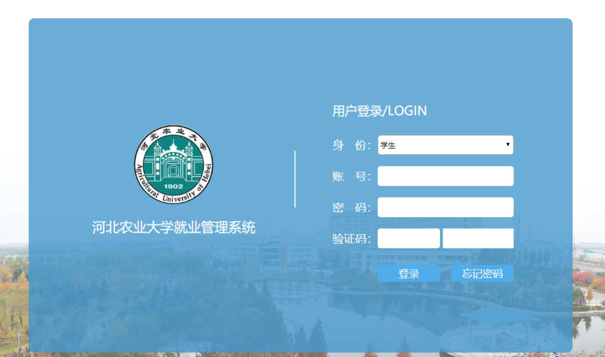
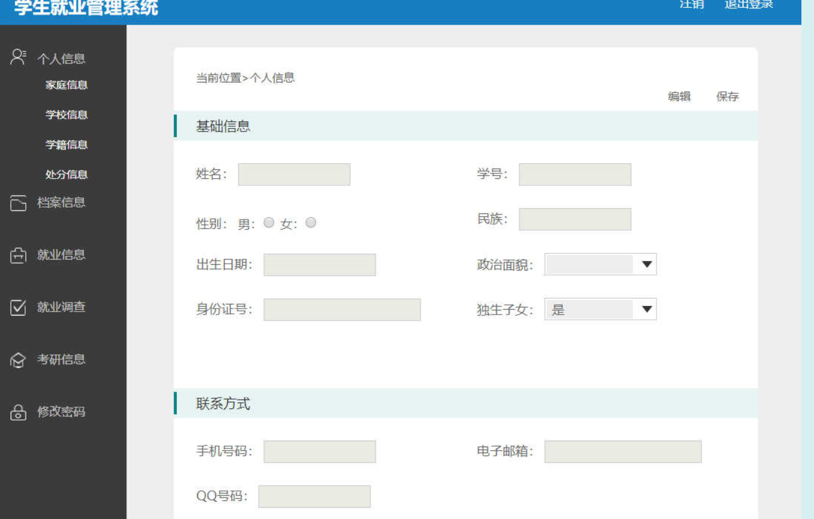
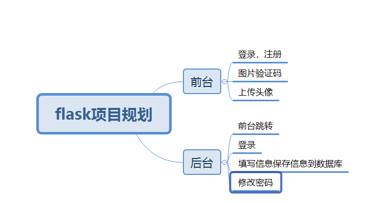

# flask项目(学生就业管理系统)
###项目介绍
一个使用Flask、MySQL、Redis等做的一个WEB项目

项目目前想要达到的功能：登录，注册，验证码

## 计划表

|日期 |计划 |是否完成 |
|----- |----- |----- |
|2020/10/19|找到适合的模板，规划好怎么开始写这个项目|已完成|
|2020/10/20|修改模板路径，规划好数据表，进行数据库迁移||
|2020/10/21|完成注册登录，并进行测试保证不出现异常状况||
|2020/10/22|||
|2020/10/23|||
|2020/10/24|||

2020/10/19
>找到合适的模板（后台）

>项目初步规划

